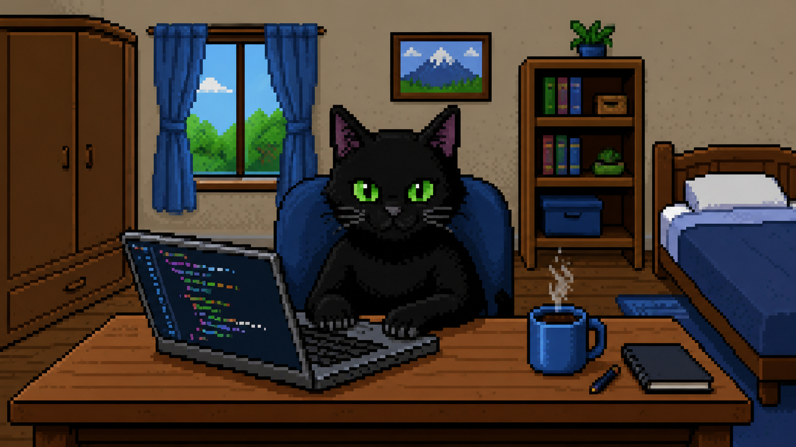
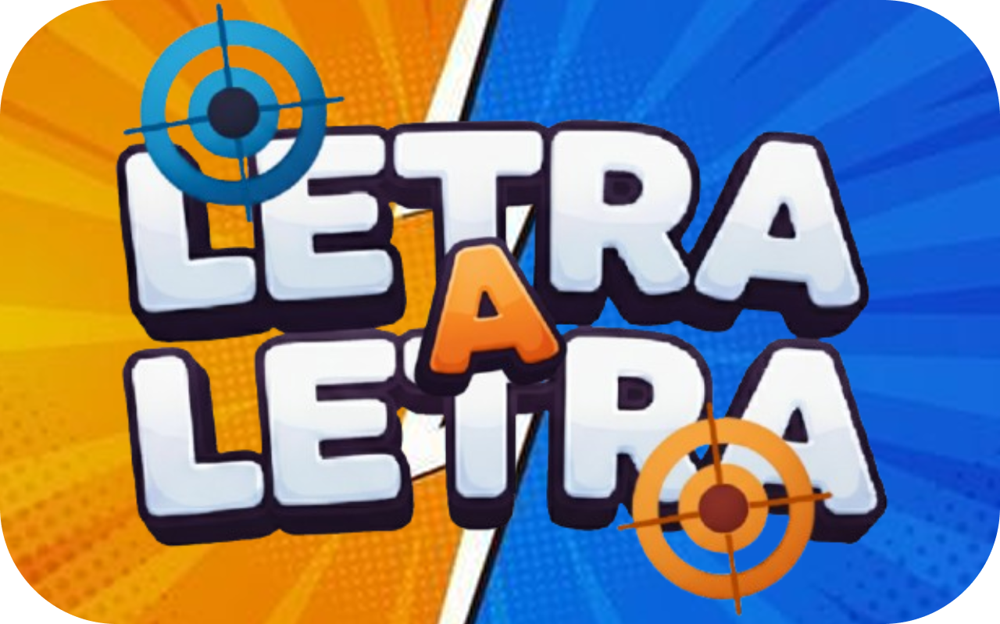
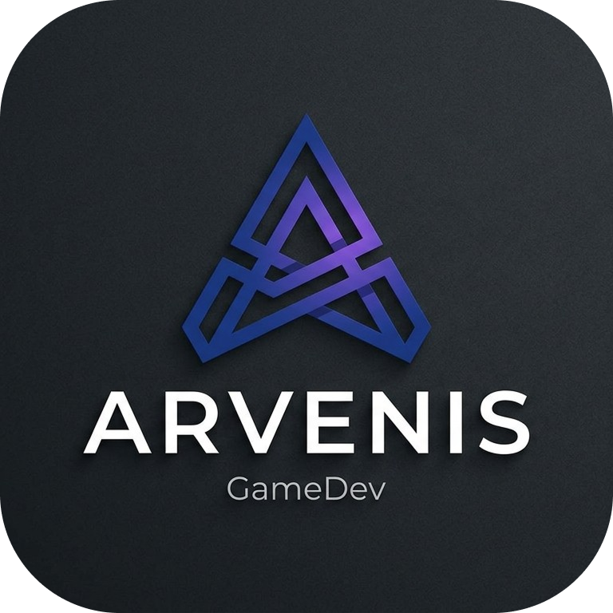

# 👋 Olá, eu sou Samuel

  </img>

  <b>Backend Developer</b> • Java 21 • Spring Boot • Clean Architecture

  Apaixonado por desenvolvimento backend, arquitetura de software e criação de jogos.

---

# 💻 Sobre mim

Sou desenvolvedor **Full Stack** com foco em **Backend**, especializado no ecossistema **Java 21 + Spring Boot**.

Tenho grande interesse por arquitetura de software, APIs escaláveis, comunicação em tempo real e boas práticas como **SOLID**, **DDD**, **Clean Architecture** e **GitFlow**.

Também acredito que a Inteligência Artificial é uma ferramenta indispensável para acelerar processos de desenvolvimento, automatizar tarefas repetitivas e aumentar a produtividade de equipes.

Além do desenvolvimento de software, lidero a **Arvenis**, um estúdio independente de desenvolvimento de jogos, onde estamos construindo nosso principal projeto: **Letra a Letra**.

---

# 🚀 Atualmente

- ☕ Desenvolvendo aplicações com **Java 21** e **Spring Boot**
- 🏗️ Estudando Arquitetura de Software
- 🤖 Utilizando IA para acelerar desenvolvimento e produtividade
- 🎮 Liderando o desenvolvimento do jogo **Letra a Letra**
- 🌱 Sempre aprendendo novas tecnologias e boas práticas

---

# ⚙️ Stack Principal

  

---

# 🎮 Projeto Principal

  </img>

Jogo multiplayer competitivo inspirado em **Batalha Naval** e **Caça-Palavras**.

O projeto está sendo desenvolvido pelo estúdio **Arvenis** e representa atualmente meu maior desafio técnico, envolvendo desenvolvimento backend, comunicação em tempo real e integração entre múltiplas tecnologias.

### Tecnologias utilizadas

- Java 21
- Spring Boot
- WebSocket
- PostgreSQL
- Godot Engine

⭐ Projeto em desenvolvimento.

---

# 🚀 Projetos em Destaque

| Projeto | Descrição | Tecnologias |
|----------|-----------|-------------|
| **🎮 Letra a Letra** | Jogo multiplayer competitivo em desenvolvimento. | Java • Spring Boot • Godot • PostgreSQL • Redis |
| **🛒 Simone Festas** | Plataforma para aluguel de artigos para festas. | Next.js • PostgreSQL |
| **🎲 Creatures Game** | Jogo de terminal desenvolvido aplicando conceitos de Programação Orientada a Objetos. | TypeScript |

---

# 📚 Projeto Acadêmico em Destaque

### API REST com Fastify

Durante o desenvolvimento deste projeto atuei como **líder da equipe**, sendo responsável por organizar o fluxo de desenvolvimento e garantir a qualidade da arquitetura da aplicação.

O projeto foi desenvolvido utilizando:

- Fastify
- TypeScript
- DDD
- Clean Architecture
- SOLID
- GitFlow

Essa experiência fortaleceu meus conhecimentos em arquitetura de software, liderança técnica e desenvolvimento colaborativo.

---

#  Arvenis Studio

A **Arvenis** é um estúdio independente de desenvolvimento de jogos.

Atualmente lidero a equipe responsável pelo desenvolvimento do **Letra a Letra**, enquanto planejamos novos projetos para o futuro.

Nosso objetivo é criar experiências criativas, divertidas e tecnicamente bem construídas.

---

# 🛠️ Tecnologias

## Backend

## Frontend

## Banco de Dados

## Ferramentas

## Extras

---

# 📈 GitHub

---

# 🌐 Contato

---

### *"Transformando ideias em software de qualidade."*

